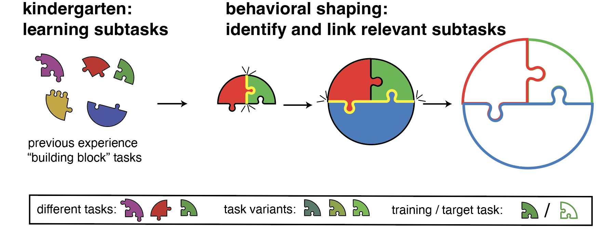

# kind_cl

A repo for kindergarten curriculum learning in RNNs. 

## Basic repo structure

- dynamics: main python module
  - process/rnn/: core code for training and simulating data from RNNs
  - analysis: behavioral, state-space, and dynamics analsyis of RNNs
  - utils: default configurations, RNN input specs, helper files
  - vis: helper plotting functions
- demo: Figure generation scripts and RNN training demo

